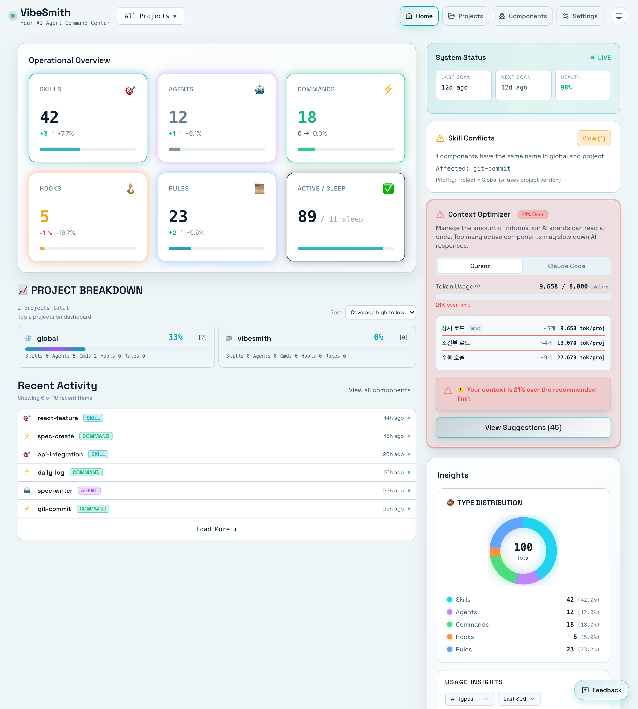
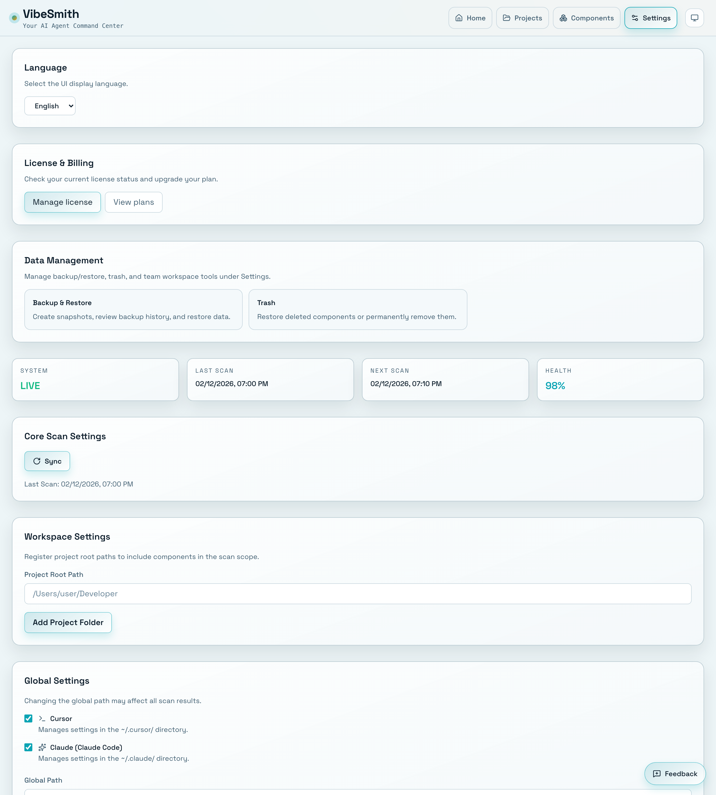

# First Steps

> 📝 This document was automatically generated. If you find any errors or have suggestions, please report them via [Issue](https://github.com/heesubsong/vibesmith-community/issues).

## First Launch

When you first launch VibeSmith, the **welcome screen** appears.

## Welcome Screen Components

1. **Project Selection**
   - Open an existing project
   - Create a new project
   - View recent projects

2. **Initial Setup Guide**
   - Verify Cursor/Claude Code path
   - Configure language preferences
   - Choose theme (Light/Dark)

3. **Tutorial**
   - Quick start guide (optional)
   - Sample project (optional)

### 💡 Useful Tips

💡 Press Esc to skip the welcome screen.
💡 You can revisit the welcome screen in Settings anytime.

## Open Project

Let's open your first project.

## How to Select a Project

### 1. File Browser
- Click the **Open Project** button
- Select your project's root directory
- VibeSmith will scan automatically

### 2. Drag and Drop
- Drag a project folder into the VibeSmith window
- Scanning begins immediately

### 3. Recent Projects
- Select from the recent projects list on the welcome screen
- Quick and easy reconnection

## Supported Project Structures

VibeSmith automatically detects the following structures:

- `.cursor/` - Cursor project
- `.claude/` - Claude Code project
- `~/.cursor/skills/` - Global skills
- `~/.claude/skills/` - Claude global skills

## First Scan

When you open a project, **auto scan** starts.

## Scan Process

1. **File Exploration**
   - Scan `.cursor/`, `.claude/` directories
   - Scan global directories
   - Takes about 5-10 seconds

2. **Parsing**
   - Parse SKILL.md files
   - Extract metadata
   - Analyze dependencies

3. **Database Storage**
   - Save to local SQLite database
   - Indexing for fast search

4. **Complete**
   - Automatically navigate to dashboard
   - Display discovered components

## Scan Results

When scan is complete, you can see:

- **Total component count**
- **Count by type** (Skills, Agents, Commands, Hooks, Rules)
- **Local vs Global** ratio
- **Recently modified items**

### 💡 Useful Tips

💡 Large projects may take 1-2 minutes for the initial scan.
💡 You can continue using the app while scanning (runs in background).
💡 To manually rescan, press Cmd+R (Mac) or Ctrl+R (Windows).

## Dashboard Tour

When the scan completes, you'll be taken to the **Dashboard**.

## Dashboard Main Areas

### 1. Top Header
- **Project Name**: Your current project
- **Search Box**: Global search (Cmd+K)
- **User Menu**: Settings and Help

### 2. Left Sidebar
- **Dashboard**: Workspace overview
- **Components**: Browse all components
  - Skills
  - Agents
  - Commands
  - Hooks
  - Rules
- **Dependencies**: Dependency graph
- **Settings**: App configuration

### 3. Main Content
- **Statistics Cards**: Key metrics at a glance
- **Recent Activity**: Latest changes
- **Quick Actions**: Common tasks

For more details, see the [Dashboard Guide](04-dashboard-overview.md).

## Basic Settings

Important settings to configure on first use.

## Required Settings

### 1. Cursor/Claude Code Path
- Navigate to **Settings** > **General** > **AI Tool Path**
- Specify your Cursor or Claude Code installation path
- Auto-detection is available

### 2. Scan Settings
- **Auto Scan**: Automatically rescan when files change
- **Scan Interval**: How often to scan in the background
- **Exclude Paths**: Directories to skip during scanning

### 3. UI Settings
- **Language**: Korean or English
- **Theme**: Light, Dark, or System
- **Font Size**: Small, Medium, or Large

## Recommended Settings

Recommended for first-time users:

- ✅ Auto Scan: Enabled
- ✅ Theme: Follow system settings
- ✅ Scan Interval: 5 minutes
- ✅ Backup: Auto backup enabled

### ⚠️ Warnings

⚠️ An incorrect path will prevent scanning from working.
⚠️ If auto scan is disabled, you must scan manually.

## Create Your First Skill

Now let's create your first skill!

## Quick Start

1. Click the **+ New Skill** button
2. Fill in the following:
   - **Name**: `hello-world`
   - **Description**: "My first test skill"
   - **Type**: Skill
   - **Path**: Local
3. Click **Create**

## Edit Your Skill

After creation, you can:
- Add detailed usage instructions
- Include code examples
- Add relevant tags

For complete skill management details, see the [Skills Management Guide](05-managing-skills.md).

## Next Steps

Congratulations! You're all set to start using VibeSmith. 🎉

What's next:
- [Dashboard Tour](04-dashboard-overview.md)
- [Managing Skills](05-managing-skills.md)
- [Dependency Graph](10-dependency-graph.md)

### 💡 Useful Tips

💡 Keep your first skill simple — it's just for testing.
💡 You can modify or delete it anytime.
💡 Consider starting with a sample skill and customizing it.

---

**Last Updated**: 2026-02-25  
**Version**: 0.1.0