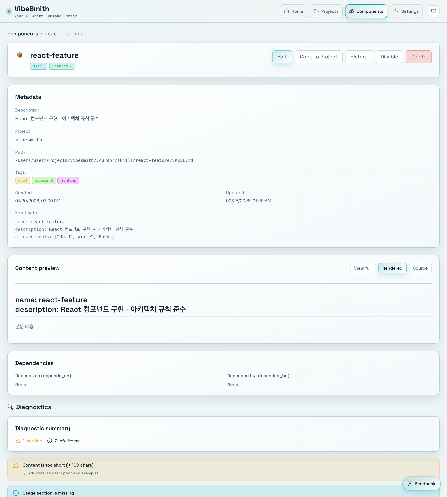

# Managing Skills

> 📝 This document was automatically generated. If you find any errors or have suggestions, please report them via [Issue](https://github.com/heesubsong/vibesmith-community/issues).

## Navigate to Skills Page

Click **Skills** in the left sidebar to view all your skills.

The Skills page displays:
- Skill names and descriptions
- Tags (categories)
- Paths (local or global)
- Status (active or inactive)

### 💡 Useful Tips

💡 Use the search box to quickly find any skill.
💡 Click a tag to filter by category.
💡 Sort by name, last modified, or category.

## Search for Skills

Type any keyword in the search box to filter skills in real-time.

Search capabilities:
- **Name search**: Find skills by name
- **Description search**: Search within descriptions
- **Tag search**: Filter by tags
- **Fuzzy search**: Typo-tolerant smart search

## Create New Skill

Click the **+ New Skill** button in the top right to open the creation dialog.

Required fields:
1. **Skill Name** (required)
2. **Description** (required)
3. **Type** (Skill, Agent, Command, Hook, or Rule)
4. **Path** (local or global)
5. **Tags** (optional)

### ⚠️ Warnings

⚠️ Skill names must use kebab-case format (e.g., `my-awesome-skill`)
⚠️ Names cannot be changed after creation — choose carefully.
⚠️ Global skills apply to all projects — use with caution.

## Fill in Skill Information

Complete each field:

### 1. Skill Name
- Use kebab-case format
- Examples: `my-awesome-skill`, `react-component-generator`
- No spaces or special characters

### 2. Description
- Clearly explain what the skill does
- Example: "Automatically generates React components"

### 3. Type Selection
- **Skill**: General AI capability
- **Agent**: Automated agent
- **Command**: Slash command
- **Hook**: Git hook
- **Rule**: Project rule

### 4. Path Selection
- **Local**: Current project only
- **Global**: All projects

### 💡 Useful Tips

💡 Detailed descriptions improve searchability.
💡 Tags help organize and find related skills.

## Complete Skill Creation

Click **Create** to finalize your skill.

What happens next:
- Your new skill appears in the skills list
- You're automatically taken to the skill detail page
- A skill file is created on disk

File locations:
- **Local**: `.cursor/skills/{skill-name}/SKILL.md`
- **Global**: `~/.cursor/skills/{skill-name}/SKILL.md`

### 📝 Notes

📝 Newly created skills work immediately in Cursor AI.
📝 You can edit skill files directly in your editor.

## View Skill Details

Click any skill card to see its full details.

Detail page includes:
- Metadata (name, description, tags)
- Full content (SKILL.md)
- Usage statistics
- Related dependencies
- Modification history

Available actions:
- ✏️ **Edit**: Modify the skill
- 📋 **Copy**: Duplicate to another project
- 🗑️ **Delete**: Remove the skill
- 🔄 **Sync**: Sync between local and global

## Edit Skill

Click **Edit** to modify your skill.

Edit modes:
- **Visual Editor**: Form-based editing
- **Markdown Editor**: Edit markdown directly
- **Live Preview**: See changes in real-time

Click **Save** when you're done.

### 💡 Useful Tips

💡 Quick save: Cmd+S (Mac) or Ctrl+S (Windows)
💡 Format help: Press Cmd+/ in the markdown editor

## Delete Skill

Click **Delete** to show a confirmation dialog.

Important notes:
- The skill file will be permanently deleted
- This action cannot be undone
- Deleting global skills affects all your projects

Confirm deletion to proceed.

### ⚠️ Warnings

⚠️ Deleted skills cannot be recovered.
⚠️ Global skill deletion affects all projects.
⚠️ Consider deactivating the skill instead of deleting.

---

**Last Updated**: 2026-02-25  
**Version**: 0.1.0