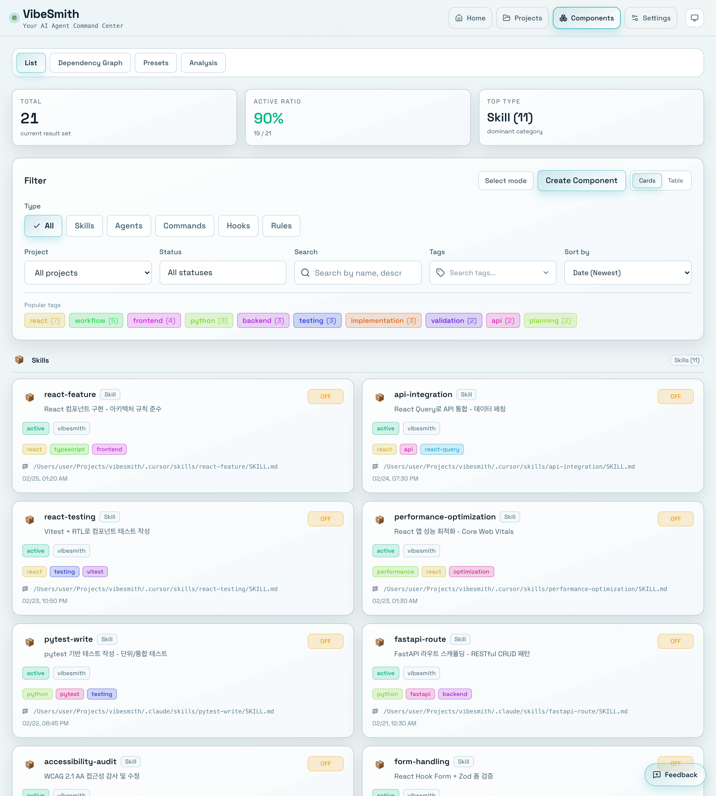

# Managing Agents

> 📝 This document was automatically generated. If you find any errors or have suggestions, please report them via [Issue](https://github.com/heesubsong/vibesmith-community/issues).

## What are Agents?

**Agents** are AI sub-agents that autonomously perform complex tasks. Unlike simple skills, agents complete tasks through multiple steps and report results.

### Agents vs Skills

| Category | Skills | Agents |
|----------|--------|--------|
| **Complexity** | Simple tasks | Complex workflows |
| **Execution** | Immediate completion | Multi-step process |
| **Autonomy** | Command execution | Autonomous judgment |
| **Output** | Code/Text | Detailed reports |

## Navigate to Agents Page



Click **Components** > **Agents** in the left sidebar to view all agents.

## Agent Types and Usage

### 1. Task Manager
**Purpose**: GitHub Projects task management

**Usage Example**:
```
@task-manager
Plan the next sprint and create Issues.
```

**Key Features**:
- Issue creation and status updates
- Priority management
- Sprint planning
- Project board management

### 2. Spec Writer
**Purpose**: Write frontend feature specifications

**Usage Example**:
```
@spec-writer
Write specification for login page feature.
```

**Key Features**:
- Technical spec generation from Issues
- Detailed component breakdown
- API interface definition
- Test scenario planning

### 3. Spec Reviewer
**Purpose**: Review and validate spec documents

**Usage Example**:
```
@spec-reviewer
Review docs/specs/login-page.md
```

**Validation Items**:
- ✅ Completeness
- ✅ Clarity
- ✅ Feasibility
- ✅ Consistency

### 4. Test Writer
**Purpose**: Generate automated test code

**Usage Example**:
```
@test-writer
Write tests for UserProfile component.
```

**Key Features**:
- Vitest + RTL + MSW based tests
- Component/Hook/Integration tests
- Coverage report

### 5. UI Implementer
**Purpose**: Implement React components

**Usage Example**:
```
@ui-implementer
Implement login page based on spec.
```

**Key Features**:
- Spec-based implementation
- Chakra UI styling
- Type-safe code
- Accessibility compliance

### 6. QA Fixer
**Purpose**: Auto-fix Quality Gate failures

**Usage Example**:
```
@qa-fixer
Fix failing tests and lints.
```

**Key Features**:
- Test/Lint/Type/Build error fixes
- Auto-retry mechanism
- Fix report generation

### 7. API Integrator
**Purpose**: Automate API integration

**Usage Example**:
```
@api-integrator
Integrate /users endpoint with React Query.
```

**Key Features**:
- API client generation
- React Query hook creation
- MSW mock handler setup
- Type definition generation

### 8. Daily Reporter
**Purpose**: Generate daily work reports

**Usage Example**:
```
@daily-reporter
Generate today's work summary.
```

**Key Features**:
- Work log aggregation
- Issue status summary
- PR status tracking
- Next action planning

### 💡 Useful Tips

💡 Agents are specialized skills that automate complex tasks.
💡 Invoke via Cursor's Task tool: `@agent-name task description`
💡 Each agent runs independently and returns detailed reports.
💡 You can continue other work while agents are running.

## Create New Agent


Click the **+ New Agent** button to open agent creation modal.

## Required Input Fields

1. **Agent Name**: kebab-case (e.g., `my-agent`)
2. **Description**: Task the agent performs
3. **Subagent Type**: Select Cursor Task type
4. **Model**: fast, alpha, beta, etc.
5. **Tools**: List of tools the agent will use

## Subagent Types

- `generalPurpose`: General tasks
- `explore`: Codebase exploration
- `shell`: Command execution
- `browser-use`: Browser automation

## View Agent Details


Click agent card to view detailed information.

## Detail Page

- **Metadata**: Name, description, type
- **Configuration**: Model, tools, options
- **Prompt**: Instructions passed to agent
- **Execution History**: Recent execution logs
- **Performance Metrics**: Success rate, average execution time

## Execute Agent

To execute agents in Cursor:

```
@task-manager Recommend next tasks
@spec-writer Write spec for login feature
@test-writer Write tests for UserProfile component
```

---

**Last Updated**: 2026-02-25  
**Version**: 0.1.0
