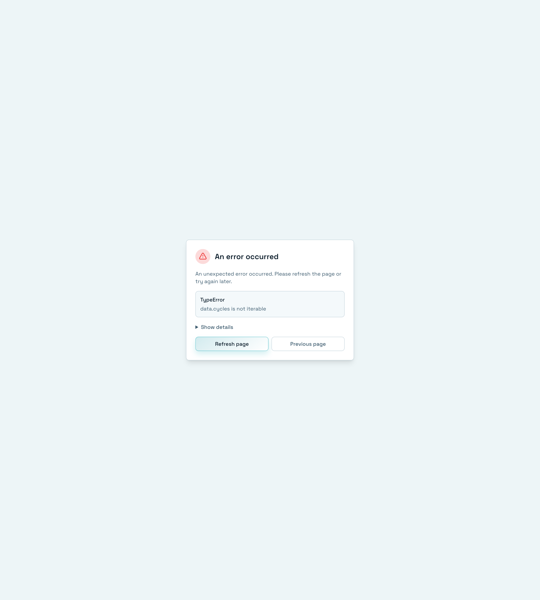

# Dependency Graph

> 📝 This document was automatically generated. If you find any errors or have suggestions, please report them via [Issue](https://github.com/heesubsong/vibesmith-community/issues).

## Open Dependency Graph




Click **Dependencies** in the left sidebar to view the interactive dependency graph.

## What is Dependency Graph?

**Dependency Graph** is an interactive diagram that visually represents relationships between all components in your project.

### Graph Elements

#### Nodes
Represent each component:
- Skills, Agents, Commands, Hooks, Rules
- Click to show details
- Hover for quick preview

#### Edges
Represent dependency relationships:
- **Solid line**: Direct dependency
- **Dashed line**: Indirect dependency
- **Arrow**: Dependency direction

#### Color Codes
- 🔵 **Blue**: Skills
- 🟢 **Green**: Agents
- 🟡 **Yellow**: Commands
- 🟣 **Purple**: Hooks
- 🔴 **Red**: Rules
- ⚫ **Gray**: External dependencies
- 🔴 **Circular**: Red highlight for circular references

#### Size
Proportional to dependency count:
- **Large nodes**: Many dependencies (hub)
- **Small nodes**: Few dependencies

### How to Use the Graph

#### 1. Dependency Analysis

**Find Circular References**
```
A → B → C → A (🔴 Problem!)
```
Circular references need refactoring.

**Identify Bottlenecks**
```
Central-Skill ← 10 components
```
Too many dependencies is a warning sign.

**Discover Isolated Components**
```
Orphan-Skill (no connections)
```
May be unused components.

#### 2. Refactoring Planning

**Assess Complexity**
- Check complexity by node size
- Check coupling by edge density
- Identify module boundaries by clusters

**Restructuring Strategy**
```
Before: A ← B, C, D, E, F (high coupling)
After:  A ← Common ← B, C, D, E, F (low coupling)
```

#### 3. Impact Assessment

**Change Impact Analysis**
```
Skill-A change → Skill-B, Skill-C affected
```

**Deletion Safety Verification**
```
Before deleting Skill-X → Verify 0 dependencies ✅
```

**Update Priority**
```
Low-Level → Mid-Level → High-Level
```

## Graph Operations

- **Zoom**: Mouse wheel or pinch
- **Pan**: Drag
- **Select**: Click node
- **Reset**: Double click

### 💡 Useful Tips

💡 Circular references displayed in red.
💡 Orphan nodes (no dependencies) shown in gray.
💡 Drag nodes to adjust layout.

## Filter and Search


Use filters at top of graph to display specific components only.

## Filter Options

- **By Type**: Skills, Agents, Commands, Hooks, Rules
- **By Path**: Local, Global
- **By Tag**: Show specific tags only
- **Depth**: Dependency exploration depth (1-3 levels)

## Search

Enter keyword in search box:
- Highlight matching nodes
- Show related dependencies
- Emphasize paths

## Layout Algorithms

- **Force-directed**: Auto placement (default)
- **Hierarchical**: Hierarchical layout
- **Circular**: Circular layout
- **Grid**: Grid layout

## Node Details


Click node to show details in right panel.

## Display Information

- **Basic Info**: Name, type, path
- **Dependencies**: Other components this component uses
- **Dependents**: Components that use this component
- **Statistics**: Total dependency count, depth

## Quick Actions

- **Open File**: Open in editor
- **View Details**: Navigate to component detail page
- **Copy**: Copy to another project
- **Related Items**: Show related dependencies only

---

**Last Updated**: 2026-02-25  
**Version**: 0.1.0
