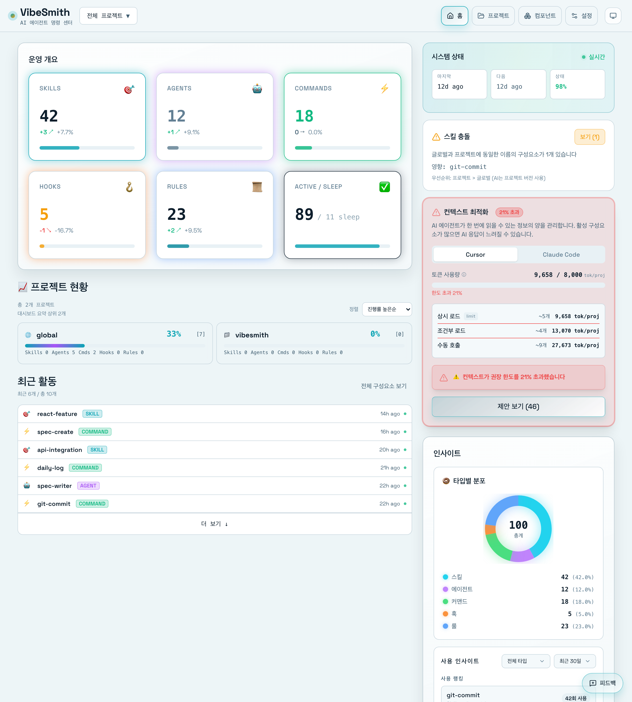
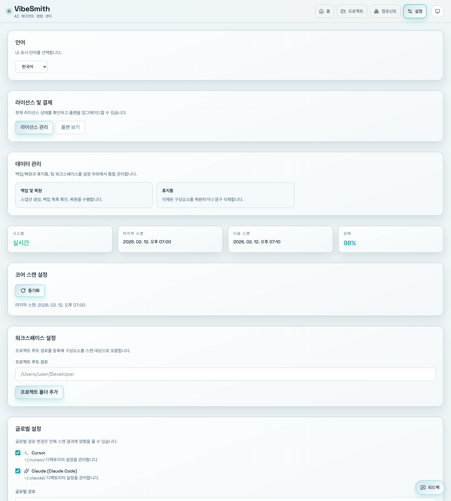

# 첫 실행 및 초기 설정

> 📝 이 문서는 자동으로 생성되었습니다. 내용이 부정확하거나 누락된 부분이 있다면 [Issue](https://github.com/heesubsong/vibesmith-community/issues)로 제보해주세요.

## 첫 실행

VibeSmith를 처음 실행하면 **환영 화면**이 나타납니다.

## 환영 화면 구성

1. **프로젝트 선택**
   - 기존 프로젝트 열기
   - 새 프로젝트 생성
   - 최근 프로젝트 목록

2. **초기 설정 가이드**
   - Cursor/Claude Code 경로 확인
   - 언어 설정
   - 테마 선택 (라이트/다크)

3. **튜토리얼**
   - 빠른 시작 가이드 (선택)
   - 샘플 프로젝트 (선택)

### 💡 유용한 팁

💡 Esc 키를 누르면 환영 화면을 건너뛸 수 있습니다.
💡 환영 화면은 설정에서 다시 볼 수 있습니다.

## 프로젝트 열기

기존 프로젝트를 열어봅시다.

## 프로젝트 선택 방법

### 1. 파일 브라우저
- **프로젝트 열기** 버튼 클릭
- 프로젝트 루트 디렉토리 선택
- VibeSmith가 자동으로 스캔

### 2. 드래그 앤 드롭
- 프로젝트 폴더를 VibeSmith 창으로 드래그
- 즉시 스캔 시작

### 3. 최근 프로젝트
- 환영 화면의 최근 프로젝트 목록에서 선택
- 빠른 재접속

## 지원되는 프로젝트 구조

VibeSmith는 다음 구조를 자동 감지합니다:

- `.cursor/` - Cursor 프로젝트
- `.claude/` - Claude Code 프로젝트
- `~/.cursor/skills/` - 글로벌 스킬
- `~/.claude/skills/` - Claude 글로벌 스킬

## 첫 스캔

프로젝트를 열면 **자동 스캔**이 시작됩니다.

## 스캔 과정

1. **파일 탐색**
   - `.cursor/`, `.claude/` 디렉토리 스캔
   - 글로벌 디렉토리 스캔
   - 약 5-10초 소요

2. **파싱**
   - SKILL.md 파일 파싱
   - 메타데이터 추출
   - 의존성 분석

3. **데이터베이스 저장**
   - 로컬 SQLite 데이터베이스에 저장
   - 빠른 검색을 위한 인덱싱

4. **완료**
   - 대시보드로 자동 이동
   - 발견된 컴포넌트 표시

## 스캔 결과

스캔이 완료되면 다음 정보를 볼 수 있습니다:

- **총 컴포넌트 수**
- **타입별 개수** (Skills, Agents, Commands, Hooks, Rules)
- **로컬 vs 글로벌** 비율
- **최근 수정된 항목**

### 💡 유용한 팁

💡 대규모 프로젝트는 첫 스캔에 1-2분 소요될 수 있습니다.
💡 스캔 중에도 앱을 사용할 수 있습니다 (백그라운드 실행).
💡 수동으로 다시 스캔하려면 Cmd+R (Mac) 또는 Ctrl+R (Windows)를 누르세요.

## 대시보드 둘러보기

스캔이 완료되면 **대시보드**로 이동합니다.

## 대시보드 주요 영역

### 1. 상단 헤더
- **프로젝트 이름**: 현재 프로젝트
- **검색창**: 전역 검색 (Cmd+K)
- **사용자 메뉴**: 설정, 도움말

### 2. 왼쪽 사이드바
- **Dashboard**: 전체 현황
- **Components**: 컴포넌트 목록
  - Skills
  - Agents
  - Commands
  - Hooks
  - Rules
- **Dependencies**: 의존성 그래프
- **Settings**: 설정

### 3. 메인 콘텐츠
- **통계 카드**: 숫자로 보는 현황
- **최근 활동**: 최근 변경사항
- **빠른 액션**: 자주 사용하는 기능

자세한 내용은 [대시보드 가이드](04-dashboard-overview.md)를 참고하세요.

## 기본 설정

첫 사용 시 확인해야 할 기본 설정입니다.

## 필수 설정

### 1. Cursor/Claude Code 경로
- **설정** > **일반** > **AI 도구 경로**
- Cursor 또는 Claude Code 설치 경로 지정
- 자동 감지 기능 제공

### 2. 스캔 설정
- **자동 스캔**: 파일 변경 시 자동 재스캔
- **스캔 주기**: 백그라운드 스캔 간격
- **제외 경로**: 스캔에서 제외할 디렉토리

### 3. UI 설정
- **언어**: 한국어/English
- **테마**: 라이트/다크/시스템
- **폰트 크기**: 작게/보통/크게

## 권장 설정

처음 사용하시는 분들께 권장하는 설정:

- ✅ 자동 스캔: 켜기
- ✅ 테마: 시스템 설정 따르기
- ✅ 스캔 주기: 5분
- ✅ 백업: 자동 백업 켜기

### ⚠️ 주의사항

⚠️ 잘못된 경로를 지정하면 스캔이 작동하지 않습니다.
⚠️ 자동 스캔을 끄면 수동으로 스캔해야 합니다.

## 첫 스킬 생성

이제 첫 번째 스킬을 만들어봅시다!

## 빠른 시작

1. **+ New Skill** 버튼 클릭
2. 다음 정보 입력:
   - **이름**: `hello-world`
   - **설명**: "첫 번째 테스트 스킬"
   - **타입**: Skill
   - **경로**: 로컬
3. **Create** 버튼 클릭

## 스킬 편집

생성된 스킬을 편집하여:
- 용도 설명 추가
- 사용 예시 작성
- 태그 추가

자세한 스킬 관리 방법은 [스킬 관리 가이드](05-managing-skills.md)를 참고하세요.

## 다음 단계

축하합니다! 이제 VibeSmith를 사용할 준비가 되었습니다. 🎉

계속해서:
- [대시보드 둘러보기](04-dashboard-overview.md)
- [스킬 관리하기](05-managing-skills.md)
- [의존성 그래프 보기](10-dependency-graph.md)

### 💡 유용한 팁

💡 첫 스킬은 간단하게 테스트용으로 만드세요.
💡 나중에 얼마든지 수정하거나 삭제할 수 있습니다.
💡 샘플 스킬을 가져와서 수정하는 것도 좋은 방법입니다.

---

**최종 업데이트**: 2026-02-25  
**버전**: 0.1.0