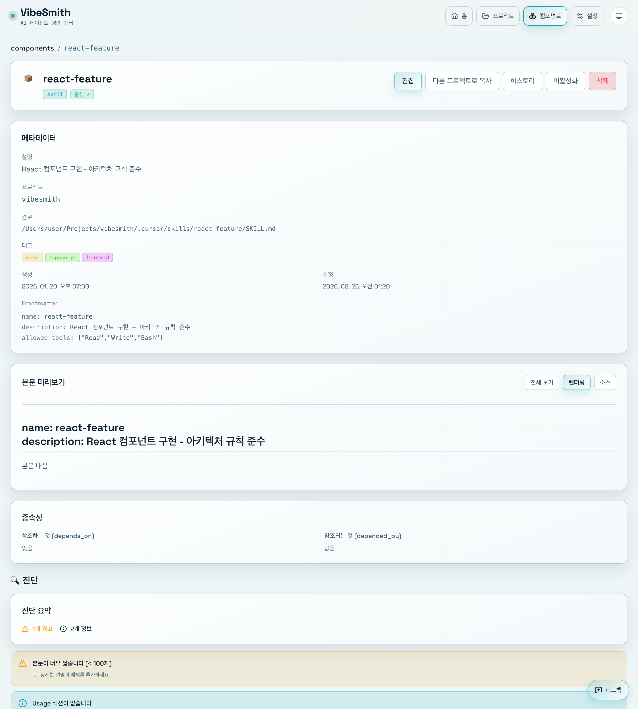

# 스킬 관리

> 📝 이 문서는 자동으로 생성되었습니다. 내용이 부정확하거나 누락된 부분이 있다면 [Issue](https://github.com/heesubsong/vibesmith-community/issues)로 제보해주세요.

## 스킬 페이지 이동

왼쪽 사이드바에서 **Skills** 메뉴를 클릭하면 모든 스킬 목록을 볼 수 있습니다.

스킬 페이지에서는 다음 정보를 확인할 수 있습니다:
- 스킬 이름과 설명
- 태그 (카테고리)
- 경로 (로컬/글로벌)
- 상태 (활성/비활성)

### 💡 유용한 팁

💡 검색창을 사용하면 원하는 스킬을 빠르게 찾을 수 있습니다.
💡 태그를 클릭하면 해당 태그의 스킬만 필터링됩니다.
💡 목록 정렬은 이름, 최근 수정일, 카테고리 순으로 가능합니다.

## 스킬 검색하기

상단의 검색창에 키워드를 입력하면 실시간으로 스킬이 필터링됩니다.

검색 기능:
- **이름 검색**: 스킬 이름에서 검색
- **설명 검색**: 스킬 설명에서 검색
- **태그 검색**: 태그에서 검색
- **퍼지 검색**: 오타를 허용하는 스마트 검색

## 새 스킬 생성하기

우측 상단의 **+ New Skill** 버튼을 클릭하면 스킬 생성 모달이 나타납니다.

모달에서 설정할 항목:
1. **스킬 이름** (필수)
2. **설명** (필수)
3. **타입** 선택 (Skill, Agent, Command, Hook, Rule)
4. **경로** 선택 (로컬/글로벌)
5. **태그** 추가 (선택)

### ⚠️ 주의사항

⚠️ 스킬 이름은 kebab-case로 작성해야 합니다. (예: `my-awesome-skill`)
⚠️ 이름은 생성 후 변경할 수 없으니 신중하게 입력하세요.
⚠️ 글로벌 스킬은 모든 프로젝트에서 사용되므로 주의가 필요합니다.

## 스킬 정보 입력하기

각 필드를 차례로 입력합니다:

### 1. 스킬 이름
- kebab-case 형식으로 입력
- 예: `my-awesome-skill`, `react-component-generator`
- 공백, 특수문자 사용 불가

### 2. 설명
- 스킬이 무엇을 하는지 명확하게 작성
- 예: "React 컴포넌트를 자동으로 생성하는 스킬"

### 3. 타입 선택
- **Skill**: 일반적인 AI 스킬
- **Agent**: 자동화된 에이전트
- **Command**: 슬래시 명령어
- **Hook**: Git 훅
- **Rule**: 프로젝트 규칙

### 4. 경로 선택
- **로컬**: 현재 프로젝트에만 적용
- **글로벌**: 모든 프로젝트에 적용

### 💡 유용한 팁

💡 설명은 나중에 검색할 때 중요하므로 상세하게 작성하세요.
💡 태그를 추가하면 관련 스킬을 쉽게 찾을 수 있습니다.

## 스킬 생성 완료

**Create** 버튼을 클릭하면 스킬이 생성됩니다.

생성 후:
- 스킬 목록에 새 스킬이 표시됩니다
- 자동으로 스킬 상세 페이지로 이동합니다
- 파일 시스템에 스킬 파일이 생성됩니다

파일 위치:
- **로컬**: `.cursor/skills/{skill-name}/SKILL.md`
- **글로벌**: `~/.cursor/skills/{skill-name}/SKILL.md`

### 📝 참고

📝 생성된 스킬 파일은 즉시 Cursor AI에서 사용할 수 있습니다.
📝 스킬 파일을 직접 편집할 수도 있습니다.

## 스킬 상세 보기

스킬 카드를 클릭하면 상세 정보를 볼 수 있습니다.

상세 페이지에서 확인 가능한 정보:
- 스킬 메타데이터 (이름, 설명, 태그)
- 스킬 내용 (SKILL.md)
- 사용 통계
- 관련 의존성
- 최근 수정 이력

가능한 액션:
- ✏️ **편집**: 스킬 내용 수정
- 📋 **복사**: 다른 프로젝트로 복사
- 🗑️ **삭제**: 스킬 삭제
- 🔄 **동기화**: 로컬 ↔ 글로벌 동기화

## 스킬 편집하기

**편집** 버튼을 클릭하면 스킬 내용을 수정할 수 있습니다.

편집 모드:
- **비주얼 에디터**: 폼 기반 편집
- **마크다운 에디터**: 직접 마크다운 편집
- **실시간 미리보기**: 변경사항 즉시 확인

편집 후 **Save** 버튼을 클릭하면 변경사항이 저장됩니다.

### 💡 유용한 팁

💡 Cmd+S (Mac) 또는 Ctrl+S (Windows)로 빠르게 저장할 수 있습니다.
💡 마크다운 에디터에서 Cmd+/ 로 포맷 도움말을 볼 수 있습니다.

## 스킬 삭제하기

**삭제** 버튼을 클릭하면 확인 대화상자가 나타납니다.

삭제 시:
- 스킬 파일이 파일 시스템에서 완전히 제거됩니다
- 복구할 수 없으니 신중하게 선택하세요
- 글로벌 스킬 삭제 시 모든 프로젝트에 영향을 줍니다

확인 후 **Delete** 버튼을 클릭하면 삭제가 완료됩니다.

### ⚠️ 주의사항

⚠️ 삭제된 스킬은 복구할 수 없습니다.
⚠️ 글로벌 스킬을 삭제하면 모든 프로젝트에서 사라집니다.
⚠️ 대신 비활성화를 고려해보세요.

---

**최종 업데이트**: 2026-02-25  
**버전**: 0.1.0