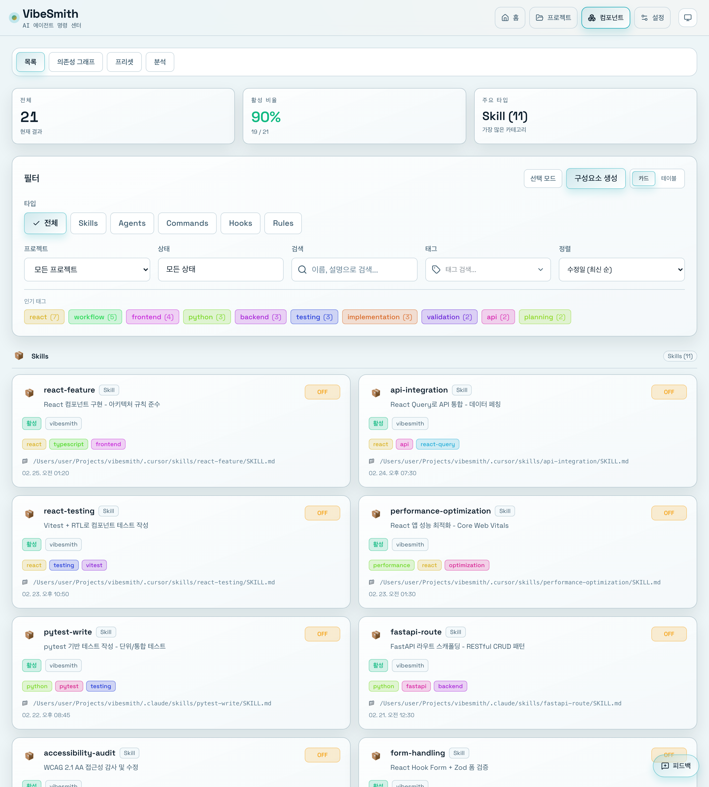

# 규칙 관리

> 📝 이 문서는 자동으로 생성되었습니다. 내용이 부정확하거나 누락된 부분이 있다면 [Issue](https://github.com/heesubsong/vibesmith-community/issues)로 제보해주세요.

## 규칙 페이지 이동



왼쪽 사이드바의 **Components** > **Rules**를 클릭하면 모든 프로젝트 규칙을 볼 수 있습니다.

규칙은 AI 에이전트가 코드 작성 시 따라야 할 지침입니다.

## 규칙 유형

- **코딩 스타일**: 네이밍, 포맷, 구조
- **아키텍처**: 패키지 구조, 의존성 규칙
- **보안**: 보안 가이드라인
- **성능**: 최적화 가이드
- **테스트**: 테스트 작성 규칙
- **문서**: 문서화 규칙

### 💡 유용한 팁

💡 규칙은 팀의 코딩 컨벤션을 AI가 자동으로 따르게 합니다.
💡 파일 패턴으로 특정 파일에만 규칙을 적용할 수 있습니다.
💡 우선순위를 설정하여 중요한 규칙을 강조할 수 있습니다.

## 새 규칙 생성


**+ New Rule** 버튼을 클릭하면 규칙 생성 모달이 나타납니다.

## 규칙 작성

1. **규칙 이름**: 명확한 이름 (예: `react-conventions`)
2. **설명**: 규칙이 적용되는 범위
3. **내용**: 구체적인 지침
4. **파일 패턴**: 적용할 파일 (globs)

## 예시: React 컴포넌트 규칙

```markdown
# React Conventions

## 파일 구조
- 컴포넌트는 PascalCase
- 훅은 useXxx
- 유틸은 camelCase

## Props
- children은 마지막 prop
- 선택적 props에 ? 사용

## 스타일
- Chakra UI 컴포넌트 우선 사용
- 인라인 스타일 지양
```

## 규칙 우선순위


규칙에는 우선순위를 설정할 수 있습니다.

## 우선순위 레벨

- **High**: 항상 적용되는 중요한 규칙
- **Medium**: 일반적인 규칙
- **Low**: 권장 사항

## 충돌 시 처리

여러 규칙이 충돌하면:
1. 우선순위가 높은 규칙 우선
2. 더 구체적인 규칙 우선 (파일 패턴)
3. 로컬 규칙이 글로벌 규칙보다 우선

## 파일 패턴

```
**/*.tsx          # 모든 TSX 파일
src/components/** # components 디렉토리 전체
**/*.test.ts      # 모든 테스트 파일
```

---

**최종 업데이트**: 2026-02-25  
**버전**: 0.1.0