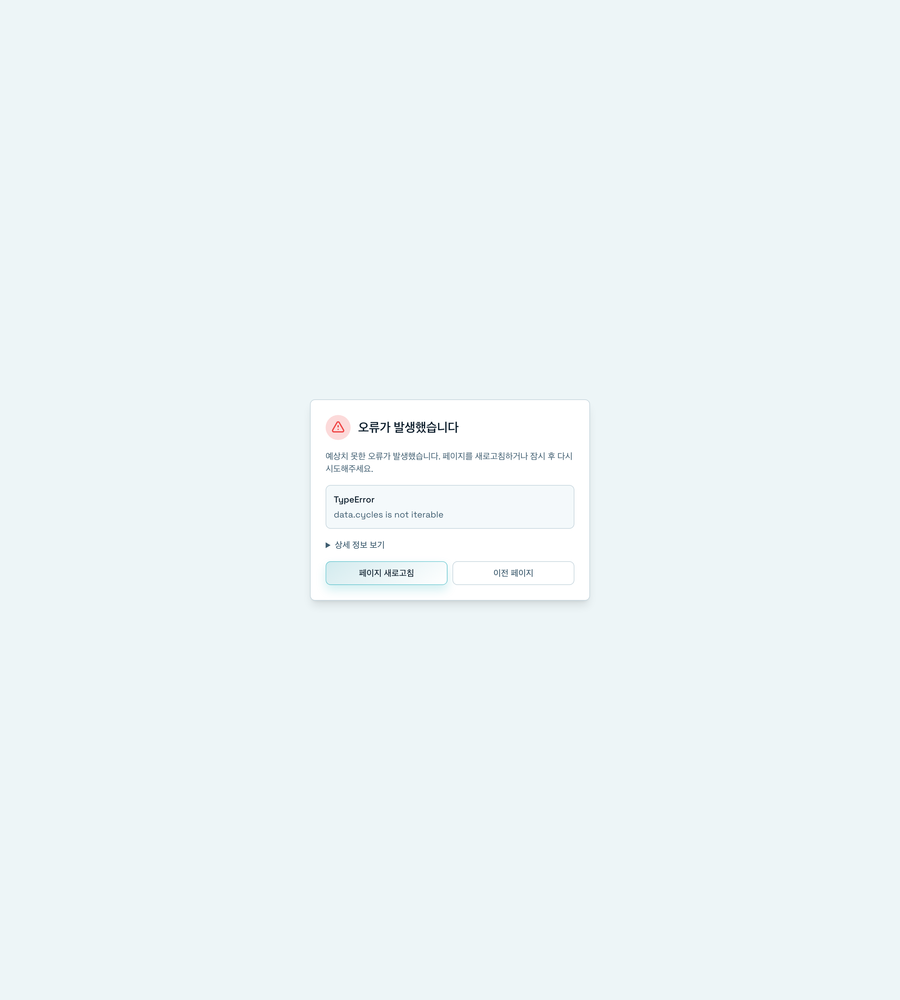

# 의존성 그래프

> 📝 이 문서는 자동으로 생성되었습니다. 내용이 부정확하거나 누락된 부분이 있다면 [Issue](https://github.com/heesubsong/vibesmith-community/issues)로 제보해주세요.

## 의존성 그래프 열기




왼쪽 사이드바의 **Dependencies**를 클릭하면 인터랙티브 의존성 그래프를 볼 수 있습니다.

## 의존성 그래프란?

**의존성 그래프(Dependency Graph)**는 프로젝트 내 모든 컴포넌트 간의 관계를 시각적으로 표현한 인터랙티브 다이어그램입니다.

### 그래프 요소

#### 노드 (Nodes)
각 컴포넌트를 나타냅니다:
- Skills, Agents, Commands, Hooks, Rules
- 클릭하면 상세 정보 표시
- 호버하면 빠른 미리보기

#### 엣지 (Edges)
의존 관계를 나타냅니다:
- **실선**: 직접 의존
- **점선**: 간접 의존
- **화살표**: 의존 방향

#### 색상 코드
- 🔵 **파란색**: Skills
- 🟢 **초록색**: Agents
- 🟡 **노란색**: Commands
- 🟣 **보라색**: Hooks
- 🔴 **빨간색**: Rules
- ⚫ **회색**: 외부 의존성
- 🔴 **순환 참조**: 빨간색 하이라이트

#### 크기
의존성 개수에 비례:
- **큰 노드**: 많은 의존성 (허브)
- **작은 노드**: 적은 의존성

### 그래프 활용법

#### 1. 의존성 분석
**순환 참조 발견**
```
A → B → C → A (🔴 문제!)
```
순환 참조는 리팩토링이 필요합니다.

**병목 지점 식별**
```
Central-Skill ← 10개 컴포넌트
```
너무 많은 의존성은 위험 신호입니다.

**고립된 컴포넌트 발견**
```
Orphan-Skill (연결 없음)
```
사용되지 않는 컴포넌트일 수 있습니다.

#### 2. 리팩토링 계획

**복잡도 파악**
- 노드 크기로 복잡도 확인
- 엣지 밀도로 결합도 확인
- 클러스터로 모듈 경계 파악

**재구조화 전략**
```
Before: A ← B, C, D, E, F (높은 결합도)
After:  A ← Common ← B, C, D, E, F (낮은 결합도)
```

#### 3. 영향 범위 파악

**변경 시 영향 분석**
```
Skill-A 변경 → Skill-B, Skill-C 영향받음
```

**삭제 안전성 검증**
```
Skill-X 삭제 전 → 0개 의존 확인 ✅
```

**업데이트 우선순위**
```
Low-Level → Mid-Level → High-Level
```

## 그래프 조작

- **확대/축소**: 마우스 휠 또는 핀치
- **이동**: 드래그
- **선택**: 노드 클릭
- **초기화**: 더블 클릭

### 💡 유용한 팁

💡 순환 참조는 빨간색으로 표시됩니다.
💡 고아 노드(의존성 없음)는 회색으로 표시됩니다.
💡 노드를 드래그하여 레이아웃을 조정할 수 있습니다.

## 필터 및 검색


그래프 상단의 필터를 사용하여 특정 컴포넌트만 표시할 수 있습니다.

## 필터 옵션

- **타입별**: Skills, Agents, Commands, Hooks, Rules
- **경로별**: 로컬, 글로벌
- **태그별**: 특정 태그만 표시
- **깊이**: 의존성 탐색 깊이 (1-3단계)

## 검색

검색창에 키워드 입력:
- 일치하는 노드 하이라이트
- 관련 의존성 표시
- 경로 강조

## 레이아웃 알고리즘

- **Force-directed**: 자동 배치 (기본)
- **Hierarchical**: 계층형 배치
- **Circular**: 원형 배치
- **Grid**: 그리드 배치

## 노드 상세 정보


노드를 클릭하면 우측 패널에 상세 정보가 표시됩니다.

## 표시 정보

- **기본 정보**: 이름, 타입, 경로
- **의존하는 항목**: 이 컴포넌트가 사용하는 다른 컴포넌트
- **의존되는 항목**: 이 컴포넌트를 사용하는 컴포넌트
- **통계**: 총 의존성 개수, 깊이

## 빠른 액션

- **파일 열기**: 에디터에서 열기
- **상세 보기**: 컴포넌트 상세 페이지로 이동
- **복사**: 다른 프로젝트로 복사
- **관련 항목**: 관련 의존성만 표시

---

**최종 업데이트**: 2026-02-25  
**버전**: 0.1.0